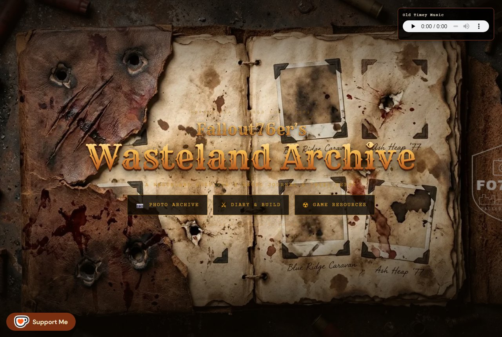

# Fallout76er's Wasteland Archive

**Live site: [fallout76er.com](https://fallout76er.com)**

A personal Fallout 76 fan site, presented as a survivor's field journal recovered from Appalachia — photo archive, field diary, creature spawn intel, scrap-farming guide, treasure-map walkthroughs, and a plans-exchange depot. Field-documented by Fallout76er, a level-491 wanderer whose vendor camp, *Rusty Curios & Rares*, sits in Burning Springs waiting for customers who mostly don't survive the trip.



## What's inside

- **Photo Archive** — screenshots presented as physical photos taped into a worn journal, each with an in-world field note, threat rating, and region. Filterable by month and category.
- **Field Diary & Build** — character bio, gear loadout, and running commentary.
- **Creature Spawn Intel** — a Pip-Boy-styled lookup of where creatures reliably spawn, with per-creature crawlable pages under [`/creatures/`](https://fallout76er.com/creatures/).
- **Treasure Map Guides** — video walkthroughs for each map, with step-by-step pages under [`/maps/`](https://fallout76er.com/maps/).
- **Scrap Guide, Nuke Codes, Minerva Tracker, Plans Exchange** — the practical stuff, updated as the wasteland demands.

## How it's built

Vanilla HTML, CSS, and JavaScript. No frameworks, no npm dependencies, no build pipeline beyond three plain Node scripts. The wasteland has enough dependencies to manage already.

| File | Role |
|---|---|
| `index.html` | The whole site, essentially — all core content, styling, and logic in one monolithic page |
| `spawn-data.js` | Creature spawn dataset (`SPAWN_DATA`) |
| `plans-data.js` | Plans-exchange dataset (`TRADE_PLANS` / `WANT_PLANS`) |
| `build_creatures.js` | Generates the `/creatures/` pages, hub, `creatures.css`, and `sitemap-creatures.xml` from `spawn-data.js` |
| `build_guides.js` | Generates the `/maps/` pages and hub from `TM_DATA` in `index.html`, and refreshes the `/maps/` section of `sitemap.xml` |
| `build_feed.js` | Generates `feed.xml` (Atom) from the photo archive and map guides |
| `.htaccess` | Caching, compression, and security headers (Apache) |

Pages under `/creatures/` and `/maps/` are generated artifacts — edit the source data and re-run the script, never the output:

```
node build_creatures.js
node build_guides.js
node build_feed.js
```

Design runs on two deliberate aesthetics: a worn-paper field journal (Rock Salt / Special Elite / Caveat, rust and parchment) for the archive, and an amber-phosphor Pip-Boy terminal (Courier, scanlines, glow) for the interactive data widgets. Videos use a click-to-load facade, so not a single MP4 byte moves until you ask for it. Large media files are deployed straight to the host and aren't versioned here.

## Disclaimer

This is an unofficial fan site. It is not affiliated with, endorsed by, or connected to Bethesda Softworks. *Fallout* and *Fallout 76* are trademarks of Bethesda Softworks LLC; all game imagery belongs to its respective owners. Site code, structure, and written content © Fallout76er.
